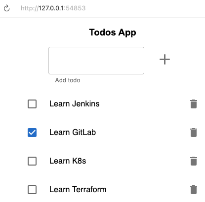

# Ejercicio 2: Monolito con base de datos

## Paso 1. Crear una capa de persistencia de datos

- Tuve que crear la imagen porque la disponible rápida estaba creada sólo para amd64 mi arquitectura es arm64 para los ejercicios. 
Llamé a la imagen todo-db:latest
```bash
cd entregables/01-monolith/todo-app
docker build -f ./Dockerfile.todos_db -t todo-db:latest .
```
- Para que minikube "vea" la imagen que he creado en local: `minikube image load todo-db:latest`
- Además he tenido que indicar que nunca intente hacer pull para que no entre en PullBackoff (con `imagePullPolicy: Never`)
- Tras aplicar los cambios:
```bash
❯ kubectl get pods
NAME                             READY   STATUS    RESTARTS      AGE
todo-db-0                        1/1     Running   0             29s
```
- Ahora aplicamos el seed de los datos tal como indican las instrucciones:
```bash
> kubectl exec todo-db-0 -it -- bash
> psql -U postgres
```
- Al pegar el script me falló porque ya existía la BBDD (supongo que por las variables de entorno), pero pegando lo de después conseguí llevarla al estado inicial.
```bash
> kubectl exec -it todo-db-0 -- psql -U postgres -d todos_db -c "SELECT * FROM todos;"
 id |     title     | completed |          due_date          | order 
----+---------------+-----------+----------------------------+-------
 12 | Learn Jenkins | f         | 2020-12-04 18:37:44.234+00 |      
 13 | Learn GitLab  | t         | 2020-12-04 18:38:06.993+00 |      
 21 | Learn K8s     | f         | 2020-12-04 19:12:16.174+00 |      
(3 rows)
```
- He configurado sólo una instancia de la bbdd ya que cada uno tiene su volumen de datos y no tendría sentido tener N bases de datos cada una
con su volumen. Sin una configuración para que se comuniquen y haya una master y otras de réplica de solo lectura, sólo podemos escalar verticalmente.
- Los artefactos que creé son:
  - El servicio en [./todo-db-svc.yml](./todo-db-svc.yml)
  - La configuración de la base de datos en un config map en [./todo-db-config.yml](./todo-db-config.yml)
  - El statefulset con la base de datos en [./todo-db-ss.yml](./todo-db-ss.yml)

## Paso 2. Crear todo-app
- Repetí los pasos de crear la imagen e injectarla dentro de minikube:
  - `docker build -f ./Dockerfile -t todo-app:latest .`
  - `minikube image load todo-app:latest`
- Creé el servicio y después el deployment:
  - Servicio tipo load balancer [./todo-app-svc.yml](./todo-app-svc.yml)
  - ConfigMap con todas las variables de entorno, como dice el enunciado [./todo-app-config.yml](./todo-app-config.yml)
    - Conecté a la bbdd a través del nombre de su servicio
  - Deployment en [./todo-app-deploy.yml](./todo-app-deploy.yml) 

Finalmente ejecuto el comando de minikube para exponer el servicio en localhost:
```bash
❯ minikube service todo-app --url
http://127.0.0.1:54853
```

Y funciona accediéndola con el navegador:
