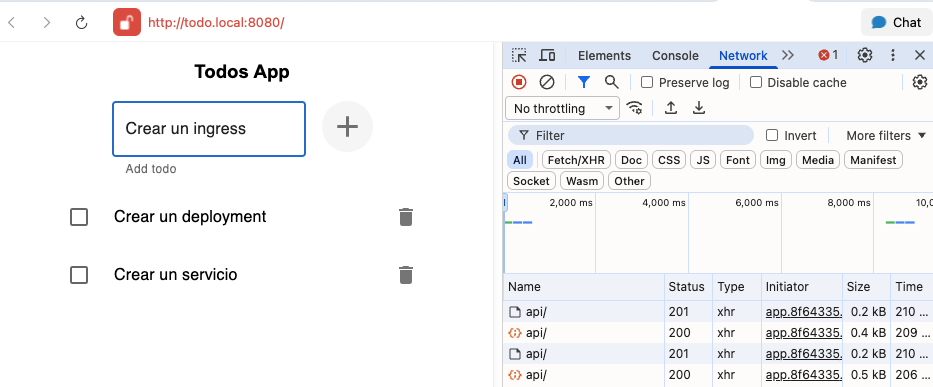

# Ejercicio 3. Aplicación Distribuida

## Paso 1 - Crear todo-front-distributed
- Creo la imagen arm64 y la inyecto en minikube:
  - `docker build -f ./Dockerfile -t todo-front-distributed:latest .`
  - `minikube image load todo-front-distributed:latest`
- Creo el deployment en [./todo-front-distributed-deploy.yml](./todo-front-distributed-deploy.yml) 
- Creo el cluster IP service [./todo-front-distributed-svc.yml](./todo-front-distributed-svc.yml)

## Paso 2 - Crear todo-api-distributed
- Creo la imagen arm64 y la inyecto en minikube:
  - `docker build -f ./Dockerfile -t todo-api-distributed:latest .`
  - `minikube image load todo-api-distributed:latest`
- Creo el deployment en [./todo-api-distributed-deploy.yml](./todo-api-distributed-deploy.yml) 
- Creo el cluster IP service [./todo-api-distributed-svc.yml](./todo-api-distributed-svc.yml)

## Paso 3 - Crear un ingress
- Creo el ingress en [./todo-distributed-ingress.yml](./todo-distributed-ingress.yml)
- Creo una entrada en mi etc/host `127.0.0.1       todo.local`
- Hago port forward `kubectl port-forward -n ingress-nginx svc/ingress-nginx-controller 8080:80`
- Accedo a http://todo.local:8080/



## Resultado

```
❯  kubectl get ingress
NAME                       CLASS   HOSTS   ADDRESS        PORTS   AGE
todo-distributed-ingress   nginx   *       192.168.49.2   80      12m

❯  minikube service list
┌───────────────┬────────────────────────────────────┬──────────────┬─────┐
│   NAMESPACE   │                NAME                │ TARGET PORT  │ URL │
├───────────────┼────────────────────────────────────┼──────────────┼─────┤
│ default       │ kubernetes                         │ No node port │     │
│ default       │ todo-api-distributed               │ No node port │     │
│ default       │ todo-front-distributed             │ No node port │     │
│ ingress-nginx │ ingress-nginx-controller           │ http/80      │     │
│               │                                    │ https/443    │     │
│ ingress-nginx │ ingress-nginx-controller-admission │ No node port │     │
│ kube-system   │ kube-dns                           │ No node port │     │
│ kube-system   │ metrics-server                     │ No node port │     │
└───────────────┴────────────────────────────────────┴──────────────┴─────┘
```